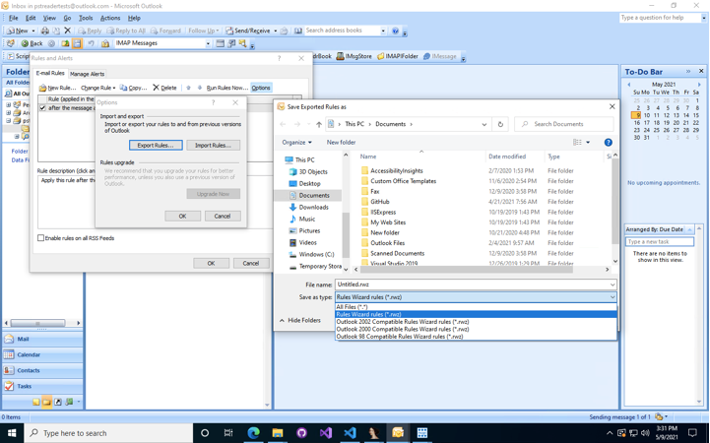
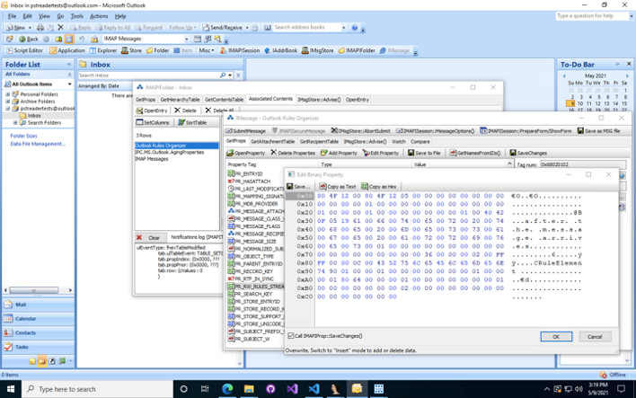
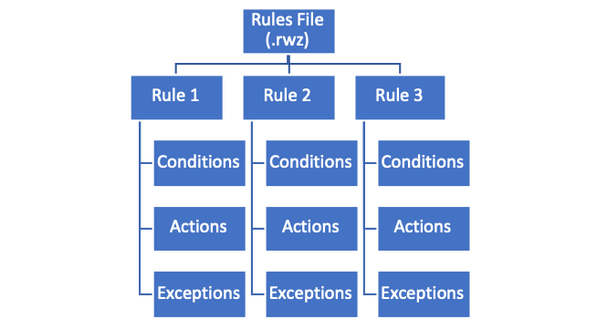

# Outlook Rules

An Outlook Rule is a set of actions that Outlook performs automatically when certain conditions are met. For example, you can use rules to move, flag, and respond to email messages automatically. You can also use rules to play sounds, move messages to folders, or display new item alerts1.

Outlook Rules began as an add-in to Outlook 972  called `RulesWiz.dll `and were integrated in-box automatically in Outlook 983.

## Storage
Outlook stores Rules Wizard Files differently depending on the version of Outlook4.

Outlook allows users to import and export Rules to a rules file with the file extension .rwz . The resulting file is known as a Rules Wizard File (shorted to RWZ file). Users can specify backwards compatibility to the latest version of Outlook, Outlook 2002, Outlook 2000 and Outlook 98. 

### Outlook 2002 and Later
User-created rules and alerts are stored in an account's PST5.

The rules stream is located in the `PR_RW_RULES_STREAM/PidTagRwRulesStream (0x68020102)`  property of a message named `Outlook Rules Organizer` of class `IPM.RuleOrganizer`6 inside the Associated Contents Table7 of the Inbox folder

### Outlook 2000 and Earlier.

User-created rules and alerts are stored in the file system.

The rules stream is located in the `C:\Documents and Settings\<username>\Application Data\Microsoft\Outlook\<ProfileName>.rwz` file.

### Additional Notes

The format of `.rwz` files and the corresponding `PidTagRwRulesStream` property is client-specific and opaque to the server8.  Some values within the header are, for example, different between the stream contained in `PidTagRwRulesStream` and the corresponding `.rwz` exported files. However, this document refers to `.rwz` files and the binary value of the `PidTagRwRulesStream` property interchangeably as, by-and-large, they have the same format.

# Introduction
The Outlook Rules (.rwz) File Format is used to store exported Outlook rules.

A rules file is a series of variable-length records, called Rules which contain variable-length records. Rules are a series of variable-length records called Rule Elements which contain conditions, actions and exceptions. 

## Glossary
This document uses the following terms:

**ASCII**: The American Standard Code for Information Interchange (ASCII) is an 8-bit character-encoding scheme based on the English alphabet. ASCII codes represent text in computers, communications equipment, and other devices that work with text. ASCII refers to a single 8-bit ASCII character or an array of 8-bit ASCII characters with the high bit of each character set to zero.

**big-endian**: Multiple-byte values that are byte-ordered with the most significant byte stored in the
memory location with the lowest address.

**globally unique identifier (GUID)**: A term used interchangeably with universally unique
identifier (UUID) in Microsoft protocol technical documents (TDs). Interchanging the usage of these terms does not imply or require a specific algorithm or mechanism to generate the value.
Specifically, the use of this term does not imply or require that the algorithms described in
[RFC4122] or [C706] must be used for generating the GUID. See also universally unique identifier (UUID).

**little-endian**: Multiple-byte values that are byte-ordered with the least significant byte stored in the memory location with the lowest address.

**timestamp**: A variant time is stored as an 8-byte real value (double), representing a date between January 1, 100 and December 31, 9999, inclusive. The value 2.0 represents January 1, 1900; 3.0 represents January 2, 1900, and so on. Adding 1 to the value increments the date by a day. The fractional part of the value represents the time of day. Therefore, 2.5 represents noon on January 1, 1900; 3.25 represents 6:00 A.M. on January 2, 1900, and so on. Negative numbers represent dates prior to December 30, 1899. The variant time resolves to one second. Any milliseconds in the input date are ignored.

**UTF-16**: A standard for encoding Unicode characters, defined in the Unicode standard, in which the most commonly used characters are defined as double-byte characters. Unless specified otherwise, this term refers to the UTF-16 encoding form specified in [UNICODE5.0.0/2007] section 3.9.

**MAY, SHOULD, MUST, SHOULD NOT, MUST NOT**: These terms (in all caps) are used as defined in [RFC2119]. All statements of optional behavior use either MAY, SHOULD, or SHOULD NOT.

## References
### Normative References
[MS-DTYP] Microsoft Corporation, ["Windows Data Types"](https://docs.microsoft.com/en-us/openspecs/windows_protocols/ms-dtyp).

[MS-OXCDATA] Microsoft Corporation, ["Data Structures"](https://docs.microsoft.com/en-us/openspecs/exchange_server_protocols/ms-oxcdata/).

[MS-OXCMSG] Microsoft Corporation, ["Message and Attachment Object Protocol"](https://docs.microsoft.com/en-us/openspecs/exchange_server_protocols/ms-oxcmsg/).

[RFC2119] Bradner, S., “Key words for use in RFCs to Indicate Requirement Levels”, BCP 14, RFC 2119, March 1997, [http://www.rfc-editor.org/rfc/rfc2119.txt](http://www.rfc-editor.org/rfc/rfc2119.txt) 

[UNICODE5.0.0] The Unicode Consortium, “Unicode Default Case Conversion Algorithm 5.0.0”, March 2006, [http://www.unicode.org/Public/5.0.0/ucd/CaseFolding.txt](http://www.unicode.org/Public/5.0.0/ucd/CaseFolding.txt)

## Overview

### Rules Structure
A rules file stores a list of rules into a single file or memory buffer. A rule consists of a list of conditions, actions and exceptions that are defined in this specification.

**Figure 1: rules files**

### Byte Ordering
Data in the rules stream are stored in little-endian format.

Some computer architectures number bytes in a binary word from left to right, which is referred to as big-endian. The byte numbering used for bitfields in this specification is big-endian. Other
architectures number the bytes in a binary word from right to left, which is referred to as little-endian.

The byte numbering used for enumerations, objects, and records in this specification is little-endian.

Using the big-endian and little-endian methods, the number 0x12345678 would be stored as shown in the following table.

| Byte order    | Byte 0 | Byte 1 | Byte 2 | Byte 3 |
|---------------|--------|--------|--------|--------|
| Big-endian    | 0x12   | 0x34   | 0x56   | 0x78   |
| Little-endian | 0x78   | 0x56   | 0x34   | 0x12   |

# References
- [1] https://support.microsoft.com/en-us/office/manage-email-messages-by-using-rules-c24f5dea-9465-4df4-ad17-a50704d66c59
- [2] https://www.computerhope.com/download/updates.htm
- [3] https://www.slipstick.com/outlook/rules/rules-wizard/ 
- [4] https://www.itprotoday.com/email-and-calendaring/how-do-you-delete-and-recreate-corrupt-outlook-rules
- [5] https://docs.microsoft.com/en-us/openspecs/exchange_server_protocols/ms-oxprops/f1fbd19a-9b2c-4c16-a07b-2242b2c0dece
- [6] https://docs.microsoft.com/en-us/openspecs/exchange_server_protocols/ms-oxorule/950a82ff-acde-40b3-8f2f-fc46ceb7a182
- [7] https://docs.microsoft.com/en-us/office/client-developer/outlook/mapi/contents-tables
- [8] https://docs.microsoft.com/en-us/openspecs/exchange_server_protocols/ms-oxorule/ee0fd52b-1161-49b8-adab-6b8c2e31c3f3
